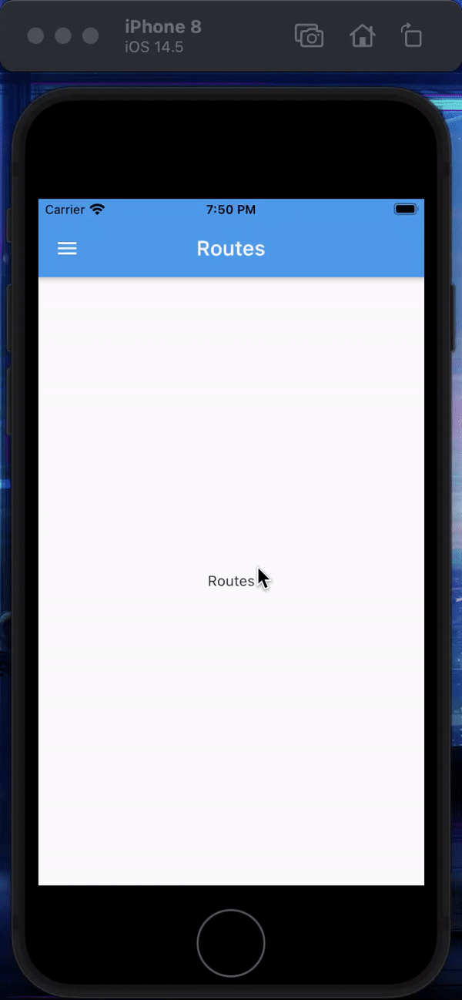

# flutter_home_work_navigation

Выполнил домашнее задание по навигации на курсе «Flutter» от Skillbox.

**Описание домашнего задания**

- Создайте приложение и выберите подход для построения навигации. Вы можете использовать как стандартные возможности flutter (onGenerateRoute), так и библиотеку для построения роутинга Fluro или любую другую библиотеку.
- В приложении должен присутствовать Drawer с двумя роутами Home, Artists. На экране artists отобразите список c данными из JSON-файла (artists.json), который находится в папке assets. По клику на элемент списка отобразите детальную страницу артиста. 
- В AppBar title отобразите имя исполнителя, а на страницу выведите информацию из поля about.
- В Drawer текущий роут должен быть подсвечен синим цветом. На детальной странице должен присутствовать AppBar со стрелкой назад.

**Критерии выполнения**

- Приложение корректноз апускается. Отсутствуютошибкив консоли.
- На экране albums отображается список артистов, при клике происходит переход на детальную страницу артиста.
- На детальнойс транице в AppBar отображается имя артиста, а на экране видна информация из поля about.
- Приложение должно выглядить как на скриншоте:

 
 

**Выполнение задания**

Flutter: v2.2.3
 
Dart: 3.13.3
 
Platform: Android, iOS
 

В качестве навигации использован onGenerateRoute.
 
 
Демонстрация выполненного задания:

Android | iOS
------------ | -------------
 | 